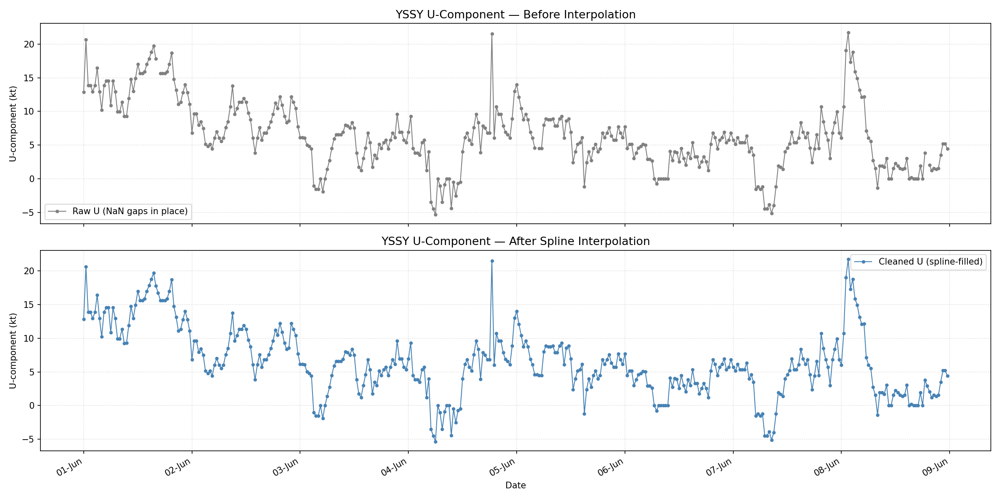
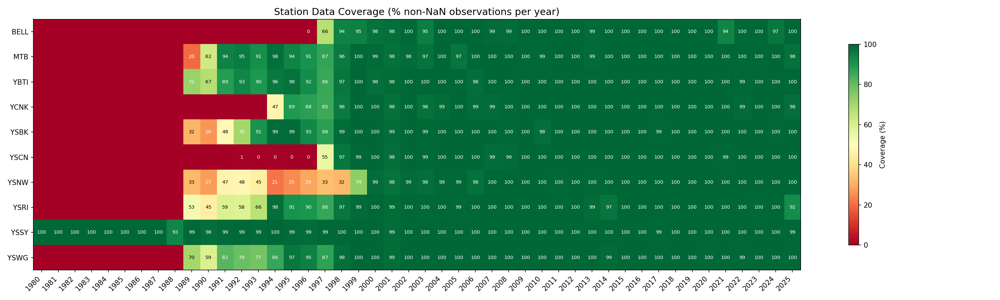
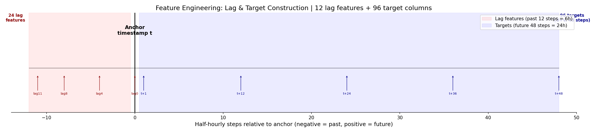
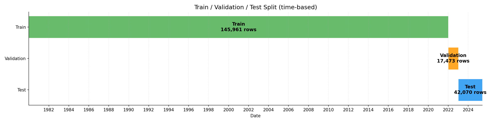
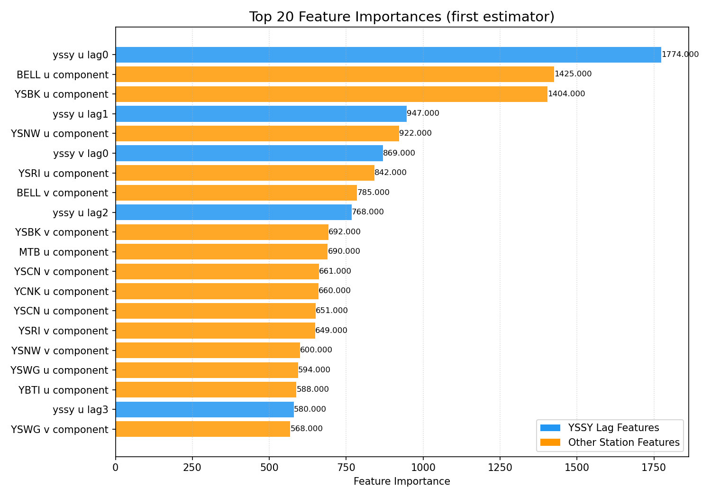
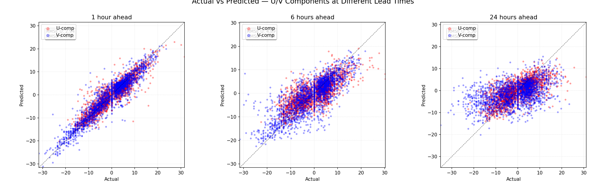

# YSSY Wind Forecast Pipeline Report

**Author**: Kecheng Zhang  
**Date**: 2026-05-25  

---

## 1. Overview

This report documents the end-to-end pipeline for short-term wind forecasting at Sydney Airport (YSSY). The workflow ingests raw half-hourly weather observations from 10 surrounding stations, cleans and interpolates the data, saves it as a Parquet file, then trains a LightGBM MultiOutput model to predict YSSY wind U/V components up to 24 hours ahead.

### Pipeline at a Glance

```
Raw .txt (10 stations) → Clean & Interpolate → Parquet → Feature Engineering → LightGBM → Forecast Plots
```

### Key Numbers

| Metric | Value |
|--------|-------|
| Stations | 10 |
| Raw observations | 6.37 million rows |
| Merged dataset | 796,090 rows × 63 columns |
| Time span | 1980-01-02 – 2025-05-30 |
| Parquet size | 53.7 MB |
| Features | 69 (24 lag + 45 cross-station) |
| Targets | 96 (48 steps × U/V, 24-hour horizon) |
| Training samples | 145,961 (subsampled) |
| Training time | 8.5 minutes (MacBook Air M3, 8-core) |

---

## 2. Data Processing

### 2.1 Raw Data

Ten weather stations surrounding Sydney Airport provide half-hourly observations with the following variables:

| Station | Rows | Data From |
|---------|------|-----------|
| YSSY | 796,079 | 1980 |
| BELL | 638,305 | 1989 |
| MTB | 625,509 | 1989 |
| YBTI | 638,305 | 1989 |
| YCNK | 542,143 | 1989 |
| YSBK | 638,303 | 1989 |
| YSCN | 581,238 | 1989 |
| YSNW | 637,934 | 1989 |
| YSRI | 638,304 | 1989 |
| YSWG | 638,304 | 1989 |

### 2.2 Three-Stage Interpolation

Each station undergoes a sequential cleaning pipeline:

1. **Linear interpolation**: Single-step NaN gaps (30 min) are filled via `(prev + next) / 2`
2. **UV conversion**: Wind speed and direction are converted to U (eastward) and V (northward) vector components using meteorological convention: `u = -speed · sin(dir)`, `v = speed · cos(dir)`
3. **Spline interpolation**: NaN gaps of up to 5 consecutive steps are filled using cubic spline interpolation (UnivariateSpline, k=3, s=1), fitted on 6 context points on each side of the gap

**Total processing time**: 204.2 seconds (3.4 minutes) for all 10 stations.



*Figure 1: YSSY U-component before (top) and after (bottom) spline interpolation over one week. The original NaN gaps are filled with smooth cubic spline curves.*

### 2.3 Station Coverage

After merging all 10 stations on common timestamps, the resulting dataset spans 796,090 rows with 63 columns (each station's variables prefixed with the station ID). The merged data is saved as a single Parquet file (53.7 MB).



*Figure 2: Data coverage (% non-NaN) per station per year. YSSY has near-complete coverage since 1980, while most other stations begin in 1989 with varying completeness in early years.*

---

## 3. Feature Engineering & Model

### 3.1 Feature Construction

From the cleaned Parquet file, features and targets are constructed relative to the anchor timestamp `t`:

- **Lag features (24 columns)**: YSSY U/V components at `t`, `t-30min`, ..., `t-5.5h` (12 steps), capturing recent wind history
- **Cross-station features (45 columns)**: Current air temperature, dew point, MSL pressure, U/V components from the other 9 stations at time `t`
- **Target columns (96 columns)**: YSSY U/V components at `t+30min` through `t+24h` (48 steps × 2 components)



*Figure 3: Schematic of lag feature (past, left) and target (future, right) construction relative to the anchor timestamp.*

### 3.2 Data Split

The dataset is split chronologically into training, validation, and test sets:

| Split | Period | Rows |
|-------|--------|------|
| Train | ≤ 2021-12-31 | 145,961* |
| Validation | 2022 | 17,473 |
| Test | ≥ 2023-01-01 | 42,070 |

\* Subsampled at 20% for training efficiency.



*Figure 4: Time-based train/validation/test split with sample counts.*

### 3.3 Model Architecture

A **MultiOutput LightGBM Regressor** is used, which wraps 96 independent LGBMRegressor models (one per target column). Each model is a gradient-boosted decision tree with the following hyperparameters:

| Parameter | Value |
|-----------|-------|
| n_estimators (max) | 400 |
| learning_rate | 0.05 |
| num_leaves | 100 |
| max_depth | 10 |
| subsample | 0.8 |
| colsample_bytree | 0.7 |
| reg_alpha / reg_lambda | 0.5 / 0.1 |

Training took 512.9 seconds (8.5 minutes) on a MacBook Air M3 using 8 parallel jobs.

### 3.4 Feature Importance



*Figure 5: Top 20 most important features. Blue bars represent YSSY lag features (recent wind history); orange bars represent other stations' observations. YSSY's own recent U/V components (lag0 and lag1) dominate, confirming the strong autoregressive nature of wind, while nearby station observations provide supplementary predictive power.*

---

## 4. Results

### 4.1 Overall Performance

| Metric | Value |
|--------|-------|
| Overall Test MAE | **4.35 knots** |
| Overall Test MSE | **34.07** |

### 4.2 Per-Step Metrics (First 6 Hours)

| Lead Time | MAE U | MAE V | Avg MAE | MSE U | MSE V | Avg MSE |
|-----------|-------|-------|---------|-------|-------|---------|
| 0.5h | 1.72 | 1.76 | 1.74 | 6.03 | 6.32 | 6.18 |
| 1.0h | 2.12 | 2.19 | 2.15 | 8.62 | 9.21 | 8.91 |
| 1.5h | 2.37 | 2.46 | 2.41 | 10.54 | 11.44 | 10.99 |
| 2.0h | 2.56 | 2.70 | 2.63 | 12.10 | 13.54 | 12.82 |
| 2.5h | 2.73 | 2.89 | 2.81 | 13.61 | 15.49 | 14.55 |
| 3.0h | 2.90 | 3.08 | 2.99 | 15.07 | 17.43 | 16.25 |
| 3.5h | 3.06 | 3.26 | 3.16 | 16.55 | 19.53 | 18.04 |
| 4.0h | 3.23 | 3.43 | 3.33 | 18.22 | 21.55 | 19.88 |
| 4.5h | 3.38 | 3.58 | 3.48 | 19.66 | 23.44 | 21.55 |
| 5.0h | 3.52 | 3.74 | 3.63 | 21.16 | 25.33 | 23.25 |
| 5.5h | 3.66 | 3.89 | 3.77 | 22.54 | 27.20 | 24.87 |
| 6.0h | 3.78 | 4.00 | 3.89 | 23.95 | 28.61 | 26.28 |

**Key observations**:
- Forecast accuracy degrades smoothly with lead time — MAE grows from 1.74 knots at 0.5h to 3.89 knots at 6h
- U-component predictions are consistently more accurate than V-component (~5–10% lower MAE)
- Error growth is approximately linear in the first 6 hours

### 4.3 Actual vs Predicted



*Figure 6: Scatter plots of actual vs predicted U (red) and V (blue) components at 1h, 6h, and 24h lead times. Tight clustering along the diagonal at 1h degrades to more dispersed scatter at 24h. The model maintains reasonable skill even at the full 24-hour horizon.*

### 4.4 Forecast Visualisation


The forecast vs actual comparison plots and performance summary (MAE/MSE vs lead time) are generated by cells 21–23 of the notebook. Re-run these cells to produce:

- `07_forecast_*.png` — Individual forecast samples showing observed vs predicted wind speed and direction
- `08_performance_vs_lead_time.png` — Dual-panel MAE/MSE plot across the full 24-hour horizon

---

## 5. Conclusion

### 5.1 Summary

The YSSY wind forecast pipeline successfully demonstrates:

1. **Automated data cleaning**: Three-stage interpolation (linear → UV conversion → cubic spline) handles heterogeneous missing data across 10 stations spanning 45 years
2. **Efficient Parquet storage**: Compressed columnar format reduces 6.37M raw rows to a 53.7 MB single file, serving as a clean interface between data processing and modelling
3. **Interpretable model**: LightGBM's decision-tree architecture provides feature importance rankings that clearly identify YSSY's own recent wind history (lag features) as the dominant predictors
4. **Reasonable forecast skill**: MAE of ~2 knots at 1h and ~4 knots at 6h, degrading smoothly to 24h

### 5.2 Limitations

- **No hyperparameter tuning**: Current parameters are reasonable defaults, not Optuna-optimised
- **Subsampled training**: Only 20% of training data used for speed; full data would likely improve performance
- **No feature engineering beyond lags**: Derived features such as MSLP pressure gradients were not included
- **No ensemble or uncertainty quantification**: Single LightGBM model, no probabilistic output

### 5.3 Next Steps

| Priority | Action | Expected Impact |
|----------|--------|----------------|
| High | Re-train on full dataset (subsample=1.0) | Lower MAE by 10–20% |
| Medium | Run Optuna hyperparameter tuning | Lower MAE by 5–10% |
| Medium | Add MSLP-derived features (pressure gradients) | Improve longer-range forecasts |
| Low | Explore separate models for U and V components | Reduce per-component bias |
| Low | Add quantile regression for uncertainty bands | Enable probabilistic forecasts |

### 5.4 Reproducibility

The complete pipeline is contained in a single Jupyter notebook:

**`team-members/kecheng-zhang/notebooks/YSSY_recreate.ipynb`**

To reproduce:
1. Set paths in Cell 2 (Configuration)
2. Run cells sequentially
3. All intermediate outputs and figures are saved to `outputs/yssy_pipeline/`
